# 同频圈 — 功能设计文档

> 传统文化艺术兴趣圈子匹配平台 · 详细功能设计与页面规格
>
> 基于 PRD V1.0 MVP · 2026-06-26 · 前端 Taro + NutUI / 后端 Next.js + PostgreSQL

---

## 1. 文档概述

本文档基于《同频圈产品需求文档 (PRD)》编写，面向工程团队，对 V1.0 MVP 的全部功能模块进行页面级拆解。每个页面包含原型线框图、字段规格、交互逻辑和边界条件，确保开发人员可以直接进入实现阶段。

> **技术栈**：前端使用 Taro + NutUI（微信小程序 + H5 + App 跨端），后端使用 Next.js API Routes + Drizzle ORM，数据库使用 PostgreSQL + PostGIS 地理空间扩展。

---

## 2. 页面导航地图

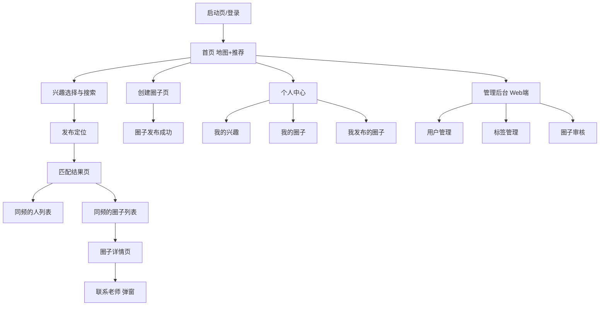

*图 1：同频圈页面导航结构*

---

## 3. 功能模块总览

| # | 模块 | 功能描述 |
|---|------|----------|
| 1 | 启动与登录 | 支持两种登录方式：微信手机快捷号登录（getPhoneNumber 获取手机号）和手机短信验证码登录。首次登录引导填写昵称和头像。已登录用户直接进入首页。登录态通过 token 维持，过期后静默刷新。 |
| 2 | 首页（地图+推荐） | 地图展示用户当前位置及周边 1/5/10/30km 范围内的兴趣点标记（人和圈子），底部展示推荐列表。顶部搜索栏可快速进入兴趣搜索。底部 Tab 切换首页/发布/个人中心。 |
| 3 | 兴趣选择与搜索 | 展示六大兴趣大类，支持关键词搜索具体兴趣项目（如"陈氏太极拳养生八式"）。搜索支持拼音首字母、模糊匹配、自定义标签创建。选中标签加入个人兴趣档案。 |
| 4 | 发布定位 | 自动获取 GPS 位置并展示在地图上，用户可拖拽调整。确认位置后发布，系统基于该位置和已选兴趣进行匹配。支持重新定位和手动选点。 |
| 5 | 匹配结果页 | 双 Tab 展示："同频的人"和"同频的圈子"。每个列表项展示头像/标题、距离、兴趣标签、活跃度。支持按距离范围筛选（1/5/10/30km）和排序。点击人项可查看详情并联系，点击圈子项进入圈子详情。 |
| 6 | 圈子详情页 | 展示圈子完整信息：标题、兴趣标签、描述、位置地图、活动时间、人数上限、创建者信息。底部"联系老师"按钮，点击后展示电话/微信（隐私保护）。创建者视角可编辑圈子信息。 |
| 7 | 创建圈子 | 老师/传承人填写圈子信息：标题、兴趣标签（搜索选择）、描述、活动位置（地图选点）、联系电话、微信号、活动时间、人数上限。提交后圈子进入系统等待匹配。 |
| 8 | 个人中心 | 展示用户信息、兴趣标签管理入口。分角色展示：普通用户看"我的兴趣""匹配记录"；老师/传承人额外看到"我发布的圈子"管理入口。设置页可调整隐私选项。 |
| 9 | 管理后台（Web 端） | Next.js 渲染的 Web 管理界面，含用户管理、标签审核与管理、圈子审核、数据统计。管理员通过账号密码登录，支持搜索、筛选、分页操作。 |

---

## 4. 页面详细设计

### P1. 启动与登录页

#### 原型线框图

```
┌─────────────────────────┐
│  9:41              5G ▌ │
├─────────────────────────┤
│                         │
│        同频圈            │
│  找到身边的传统文化伙伴    │
│                         │
│  ┌───────────────────┐  │
│  │ +86 | 请输入手机号  │  │
│  └───────────────────┘  │
│  ┌───────────────────┐  │
│  │ 请输入验证码  获取验证码│  │
│  └───────────────────┘  │
│  ┌───────────────────┐  │
│  │       登录         │  │
│  └───────────────────┘  │
│  ── 其他登录方式 ──     │
│  ┌───────────────────┐  │
│  │ 微信 手机快捷号登录  │  │
│  └───────────────────┘  │
│                         │
│ 登录即代表同意《用户协议》 │
│ 和《隐私政策》            │
└─────────────────────────┘
```

#### 功能说明

用户首次打开应用，页面中间展示短信验证码登录表单（手机号输入 + 验证码输入 + 获取验证码按钮 + 登录按钮），表单下方分隔线后展示"微信手机快捷号登录"作为快捷入口。已登录用户（本地存有有效 token）直接跳转首页。

#### 交互逻辑

- **手机号输入框** `input` [必填]：输入 11 位手机号；前置固定 +86 国家码；失焦时校验格式
- **验证码输入框** `input` [必填]：输入 6 位数字验证码；与右侧"获取验证码"按钮同行展示
- **点击"获取验证码"** `button` [必填]：先校验手机号格式 → 校验通过后调用后端发送短信 → 按钮变为 60s 倒计时禁用状态（"59s 后重新获取"）→ 倒计时结束恢复为"获取验证码"
- **点击"登录"** `button` [必填]：校验手机号和验证码非空 → POST /api/auth/sms/login → 后端校验验证码 → 通过手机号创建/查找用户 → 返回 token → 存入本地存储 → 跳转首页
- **点击"微信手机快捷号登录"** `button (open-type="getPhoneNumber")`：调起微信手机号授权弹窗 → 获取加密手机号 → POST /api/auth/login → 后端解密并创建/查找用户 → 返回 token → 存入本地存储 → 跳转首页
- **协议链接** `text link`：点击打开协议页面（WebView 或原生渲染）

#### 字段规格

| 字段 | 类型 | 必填 | 验证规则 |
|------|------|------|----------|
| phone | string | 是 | 中国大陆手机号格式（1[3-9]开头 11 位数字） |
| code | string | 是 | 6 位数字，5 分钟内有效 |

#### 边界条件

- 手机号为空：登录按钮禁用
- 手机号格式错误：输入框下方红字提示"请输入正确的手机号"，"获取验证码"按钮禁用
- 验证码为空：登录按钮禁用
- 验证码错误：提示"验证码错误或已过期，请重新获取"
- 验证码发送频率限制：同一手机号 60s 内只能发送 1 次，每天最多 10 次
- 用户拒绝手机号授权（快捷号登录）：停留在登录页，提示"需要手机号授权才能使用"
- 网络超时：展示重试提示"网络异常，请重试"
- token 过期：静默刷新，失败则返回登录页

---

### P2. 首页（地图+推荐）

#### 原型线框图

```
┌─────────────────────────┐
│  9:41              5G ▌ │
├─────────────────────────┤
│ 同频圈              🔔   │
├─────────────────────────┤
│ 🔍 搜索兴趣、圈子、老师   │
├─────────────────────────┤
│                         │
│   📍 地图视图            │
│   (1/5/10/30km 标记点)   │
│                         │
├─────────────────────────┤
│ [1km] 5km 10km 30km     │
├─────────────────────────┤
│ 附近推荐                  │
│ ┌─────────────────────┐ │
│ │● 陈氏太极拳晨练班 0.8km│ │
│ │ [陈氏太极拳][养生八式] │ │
│ └─────────────────────┘ │
│ ┌─────────────────────┐ │
│ │● 王老师·书法 1.2km   │ │
│ │ [颜体楷书]            │ │
│ └─────────────────────┘ │
├─────────────────────────┤
│ 🏠首页  ➕发布  👤我的    │
└─────────────────────────┘
```

#### 页面结构

- **顶部搜索栏** `input`：点击跳转至兴趣搜索页 P3；支持搜索兴趣关键词、圈子名称、老师昵称
- **地图区域** `map`：展示用户当前位置和周边标记点；人标记为蓝色圆点，圈子标记为红色图钉；点击标记弹出简要信息卡片
- **范围筛选标签** `tab group`：1km / 5km / 10km / 30km 四档，切换后地图和列表同步刷新；默认选中 5km
- **推荐列表** `scroll list`：混合展示附近的人和圈子，按匹配排序规则排列；每项展示名称、距离、兴趣标签
- **底部 Tab 栏** `tab bar`：首页 / 发布 / 我的三个入口；"发布"点击弹出选择：发布定位 或 创建圈子

#### 交互逻辑

进入页面时请求定位权限，获取当前位置后调用匹配接口加载附近数据。地图标记和列表数据同源，点击列表项跳转对应详情页。下拉刷新重新加载，上拉触底加载更多。

#### 边界条件

- 未授权定位：展示引导卡片"请开启定位以发现附近同频的人"，附带"去设置"按钮
- 附近无数据：展示空状态插画"附近还没有同频的人，试试扩大搜索范围"
- 用户未选择兴趣：列表展示全部类型，顶部提示"选择兴趣获得精准推荐"

---

### P3. 兴趣选择与关键词搜索

#### 原型线框图

```
┌─────────────────────────┐
│  9:41              5G ▌ │
├─────────────────────────┤
│ ← 选择兴趣        完成(2) │
├─────────────────────────┤
│ 🔍 输入兴趣关键词        │
├─────────────────────────┤
│ 搜索联想                  │
│  陈氏太极拳养生八式 [太极拳]│
│  陈氏太极拳老架一路 [太极拳]│
├─────────────────────────┤
│ 已选标签                  │
│ ✓陈氏太极拳养生八式 ✓八段锦│
├─────────────────────────┤
│ 兴趣分类                  │
│ ┌─────────────────────┐ │
│ │🥋 武术养生            │ │
│ │[太极拳][八段锦][五禽戏]│ │
│ └─────────────────────┘ │
│ ┌─────────────────────┐ │
│ │🎵 民族器乐            │ │
│ │[古筝][二胡][琵琶][笛子]│ │
│ └─────────────────────┘ │
└─────────────────────────┘
```

#### 页面结构

- **搜索框** `input`：实时输入触发搜索联想，支持中文、拼音首字母；输入 ≥1 字符开始联想
- **搜索联想列表** `suggest list`：展示匹配的兴趣标签，每项含标签名和所属大类；点击即选中并加入"已选标签"
- **已选标签区** `tag list`：展示已选标签，点击 × 可移除；右上角显示已选数量
- **兴趣分类列表** `category list`：展示六大兴趣大类及常用子标签，点击大类展开全部子项
- **"自定义添加"入口** `button`：搜索无匹配结果时展示，点击弹出输入框创建自定义标签
- **完成按钮** `button`：保存已选标签到用户兴趣档案，返回上一页

#### 搜索匹配规则

| 输入类型 | 匹配方式 | 示例 |
|----------|----------|------|
| 具体项目名 | 全文/包含匹配 | "陈氏太极拳养生八式" |
| 流派风格 | 标签名包含匹配 | "颜体楷书" |
| 拼音首字母 | pinyin 字段匹配 | "cstj" → 陈氏太极拳 |
| 模糊关键词 | 分词后 OR 匹配 | "太极" → 所有太极拳项目 |
| 无匹配 | 展示"自定义添加" | 用户输入新标签名 |

#### 边界条件

- 搜索结果为空：展示"未找到匹配兴趣，点击自定义添加"
- 已选标签超过 10 个：提示"最多选择 10 个兴趣标签"
- 自定义标签提交后状态为"待审核"，匹配时仍可使用

---

### P4. 发布定位

#### 原型线框图

```
┌─────────────────────────┐
│  9:41              5G ▌ │
├─────────────────────────┤
│ ← 发布定位        发布   │
├─────────────────────────┤
│                         │
│   📍 当前位置标记(可拖拽) │
│              🎯重新定位  │
│                         │
├─────────────────────────┤
│ 当前位置                  │
│ 北京市朝阳区朝阳公园南路1号│
├─────────────────────────┤
│ 我的兴趣                  │
│ [陈氏太极拳养生八式][八段锦]│
│ + 修改兴趣               │
├─────────────────────────┤
│ 匹配范围                  │
│ 1km  5km  10km  30km    │
├─────────────────────────┤
│      [发布并匹配]         │
└─────────────────────────┘
```

#### 页面结构

- **地图区域** `map`：展示当前 GPS 定位，中心为可拖拽标记；拖拽结束后逆地理编码获取地址
- **重新定位按钮** `button`：点击重新请求 GPS 定位，恢复到当前位置
- **当前位置卡片** `card`：展示逆地理编码后的详细地址，可点击编辑
- **我的兴趣卡片** `card`：展示已选兴趣标签，点击"修改兴趣"跳转 P3 兴趣搜索页
- **匹配范围选择** `tab group`：1/5/10/30km 四档单选，默认 5km
- **发布并匹配按钮** `button`：提交定位和兴趣信息至后端，跳转匹配结果页 P5

#### 交互逻辑

页面加载时自动请求 GPS 定位。若用户已有兴趣标签则自动填充，否则提示先选择兴趣。拖拽地图标记时实时更新地址显示。点击"发布并匹配"时将 location（经纬度）、address、tag_ids、range 提交至后端，后端存储定位记录并返回匹配结果。

#### 数据提交字段

| 字段 | 类型 | 必填 | 说明 |
|------|------|------|------|
| latitude | float | 是 | 纬度 |
| longitude | float | 是 | 经度 |
| address | string | 是 | 逆地理编码地址 |
| tag_ids | int[] | 是 | 已选兴趣标签 ID 列表 |
| range_km | int | 是 | 匹配范围（1/5/10/30） |

#### 边界条件

- GPS 信号弱：使用上次缓存位置，提示"定位可能不准确，请确认位置"
- 未选择兴趣：禁用发布按钮，提示"请先选择兴趣"
- 发布频率限制：同一用户 5 分钟内只能发布 1 次，防止刷量

---

### P5. 匹配结果页

#### 原型线框图

```
┌─────────────────────────┐
│  9:41              5G ▌ │
├─────────────────────────┤
│ ← 匹配结果      🔄 刷新   │
├─────────────────────────┤
│ [同频的人(8)] 同频的圈子(3)│
├─────────────────────────┤
│ [全部] ≤1km ≤5km ≤10km  │
├─────────────────────────┤
│ ┌─────────────────────┐ │
│ │(李) 李师傅·太极拳 0.5km│ │
│ │   [陈氏太极拳][养生八式]│ │
│ │   活跃度:高·练习3年    │ │
│ └─────────────────────┘ │
│ ┌─────────────────────┐ │
│ │(张) 张阿姨·八段锦 1.8km│ │
│ │   [八段锦]            │ │
│ │   活跃度:中·练习1年    │ │
│ └─────────────────────┘ │
└─────────────────────────┘
```

#### 页面结构

- **Tab 切换** `tab`："同频的人"和"同频的圈子"两个 Tab，括号内显示匹配数量；切换时加载对应列表
- **范围筛选** `filter`：全部 / ≤1km / ≤5km / ≤10km，用于二次筛选匹配结果
- **人列表项** `list item`：头像、昵称+特长、距离、兴趣标签、活跃度+练习时长；点击进入用户简要资料弹窗
- **圈子列表项** `list item`：圈子标题、距离、兴趣标签、活动时间、成员数；点击进入圈子详情页 P6
- **刷新按钮** `button`：重新请求匹配结果，更新列表

#### 匹配排序规则

| 维度 | 同频的人权重 | 同频的圈子权重 |
|------|-------------|---------------|
| 距离 | 40% | 30% |
| 兴趣重合度 | 40% | 50% |
| 活跃度 | 20% | 20% |

#### 交互逻辑

从发布定位页跳转时携带 location 和 tag_ids 参数，页面加载时调用两个接口分别获取人和圈子匹配结果。Tab 切换不发起新请求，使用已缓存数据。范围筛选为前端过滤。点击人列表项弹出底部弹窗展示简要资料和联系方式。

#### 边界条件

- 匹配结果为空：展示"附近暂无同频的人/圈子，试试扩大范围"
- 用户未公开联系方式：联系按钮置灰，提示"对方未开放联系方式"
- 列表加载更多：每页 20 条，触底加载下一页

---

### P6. 圈子详情页

#### 原型线框图

```
┌─────────────────────────┐
│  9:41              5G ▌ │
├─────────────────────────┤
│ ← 圈子详情         ⋯    │
├─────────────────────────┤
│ 朝阳公园陈氏太极拳晨练班  │
│ [陈氏太极拳][养生八式]    │
├─────────────────────────┤
│ (王) 王师傅              │
│      陈氏太极拳第十二代传人│
│      ·从业20年           │
├─────────────────────────┤
│ 圈子介绍                  │
│ 每周六日早晨7:00-8:30在  │
│ 朝阳公园南门广场练习...   │
├─────────────────────────┤
│ 活动时间                  │
│ 每周六、日 07:00-08:30   │
├─────────────────────────┤
│ 活动地点                  │
│ 📍 朝阳公园南门广场       │
│   [小地图]               │
├─────────────────────────┤
│ 成员人数        12/20人  │
├─────────────────────────┤
│      [联系老师]          │
└─────────────────────────┘
```

#### 页面结构

- **圈子标题** `text`：圈子名称，页面顶部展示
- **兴趣标签** `tag list`：圈子关联的兴趣标签列表
- **创建者卡片** `card`：头像、昵称、简介（身份/从业年限）；创建者视角此处展示"编辑"入口
- **圈子介绍** `text`：圈子描述信息，支持长文本展示
- **活动时间** `text`：圈子活动时间安排描述
- **活动地点** `map + text`：地址文本 + 内嵌小地图展示位置
- **成员人数** `text`：当前成员数 / 人数上限
- **联系老师按钮** `button`：点击后底部弹出联系方式弹窗（电话/微信），隐私保护

#### 联系弹窗交互

点击"联系老师"→ 底部弹窗滑出，展示联系电话（可点击拨号）和微信号（可复制）。弹窗内提示"请说明来自同频圈"。后端记录一次"被联系"事件用于统计。若老师未填写任何联系方式，按钮展示为"对方暂未开放联系方式"。

#### 创建者视角

圈子创建者浏览自己的圈子时，底部按钮变为"编辑圈子信息"，点击跳转编辑页面（复用 P7 表单）。额外展示"被联系次数"统计。

#### 边界条件

- 圈子已被创建者删除：展示"该圈子已不存在"，提供返回首页入口
- 成员已满：展示"圈子已满"，联系按钮仍可用（可沟通候补）
- 圈子在审核中：仅创建者可见，顶部标注"审核中"状态

---

### P7. 创建圈子页

#### 原型线框图

```
┌─────────────────────────┐
│  9:41              5G ▌ │
├─────────────────────────┤
│ ← 创建圈子        发布   │
├─────────────────────────┤
│ 圈子标题 *               │
│ ┌─────────────────────┐ │
│ │请输入圈子名称...     │ │
│ └─────────────────────┘ │
│ 兴趣标签 *               │
│ ┌─────────────────────┐ │
│ │🔍 搜索并选择兴趣标签  │ │
│ └─────────────────────┘ │
│ ✓陈氏太极拳 ✓养生八式    │
│ 圈子描述 *               │
│ ┌─────────────────────┐ │
│ │介绍教学内容...       │ │
│ └─────────────────────┘ │
│ 活动地点 *               │
│ ┌─────────────────────┐ │
│ │   点击地图选点        │ │
│ └─────────────────────┘ │
│ 📍 点击选点或搜索地址     │
│ 联系电话                 │
│ ┌─────────────────────┐ │
│ │请输入手机号          │ │
│ └─────────────────────┘ │
│ 微信号                  │
│ ┌─────────────────────┐ │
│ │请输入微信号          │ │
│ └─────────────────────┘ │
│ 活动时间（选填）          │
│ ┌─────────────────────┐ │
│ │如"每周六早7:00-8:30" │ │
│ └─────────────────────┘ │
│ 人数上限（选填）          │
│ ┌─────────────────────┐ │
│ │如 20                │ │
│ └─────────────────────┘ │
│      [确认发布]          │
└─────────────────────────┘
```

#### 字段规格

| 字段 | 类型 | 必填 | 验证规则 |
|------|------|------|----------|
| title | string | 是 | 2-50 字符，不允许纯符号 |
| tag_ids | int[] | 是 | 至少 1 个，最多 5 个标签 |
| description | text | 是 | 10-1000 字符 |
| latitude | float | 是 | 纬度，-90 到 90 |
| longitude | float | 是 | 经度，-180 到 180 |
| address | string | 是 | 逆地理编码地址，max 200 字符 |
| contact_phone | string | 否 | 手机号格式校验，与微信号至少填一项 |
| wechat | string | 否 | 微信号格式校验，与电话至少填一项 |
| activity_time | string | 否 | max 100 字符，自由文本描述 |
| max_members | int | 否 | 1-999，不填则不限 |

#### 交互逻辑

兴趣标签选择复用 P3 搜索组件，点击搜索框弹出搜索面板。活动地点通过内嵌地图选点，支持搜索地址后定位。表单实时校验，必填项未填写时"确认发布"按钮禁用。联系电话和微信号至少填写一项，否则提示"请至少填写一种联系方式"。

#### 提交流程

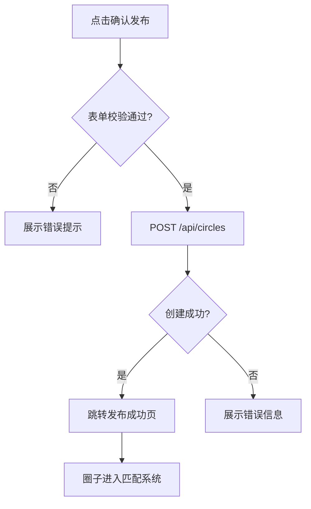

#### 边界条件

- 同一用户 24 小时内最多创建 5 个圈子，防止刷量
- 提交后圈子状态为"活跃"，立即可被匹配
- 网络超时：保留表单内容，提示"发布失败，请重试"

---

### P8. 个人中心

#### 原型线框图

```
┌─────────────────────────┐
│  9:41              5G ▌ │
├─────────────────────────┤
│ 我的                ⚙️   │
├─────────────────────────┤
│ (王) 王师傅              │
│      陈氏太极拳传承人     │
├─────────────────────────┤
│ 我的兴趣          管理   │
│ [陈氏太极拳][养生八式]    │
├─────────────────────────┤
│ 📍 我的匹配记录      ›   │
├─────────────────────────┤
│ 👥 我的圈子       3个 ›  │
├─────────────────────────┤
│ 📝 我发布的圈子    2个 ›  │
├─────────────────────────┤
│ 🔒 隐私设置          ›   │
├─────────────────────────┤
│ 🏠首页  ➕发布  👤我的    │
└─────────────────────────┘
```

#### 页面结构

- **用户信息卡片** `card`：头像、昵称、身份标签（爱好者/传承人）；点击可编辑个人资料
- **我的兴趣** `card + link`：展示当前兴趣标签，点击"管理"跳转 P3 编辑兴趣
- **我的匹配记录** `link`：查看历史匹配记录列表
- **我的圈子** `link`：已加入的圈子列表
- **我发布的圈子** `link`：仅老师/传承人角色可见；管理已发布的圈子，支持编辑/下线
- **隐私设置** `link`：设置是否公开联系方式、是否允许被匹配、位置精度

#### 角色差异

| 功能入口 | 爱好者 | 老师/传承人 |
|----------|--------|------------|
| 我的兴趣 | 可见 | 可见 |
| 我的匹配记录 | 可见 | 可见 |
| 我的圈子 | 可见 | 可见 |
| 我发布的圈子 | 不可见 | 可见（高亮显示） |
| 隐私设置 | 可见 | 可见 |

#### 隐私设置项

- **公开联系方式** `switch`：关闭后他人无法看到电话/微信
- **允许被匹配** `switch`：关闭后不出现在他人的匹配结果中
- **位置精度** `select`：精确/社区级/区域级，控制他人看到的距离精度

---

### P9. 管理后台（Web 端）

管理后台为 Next.js App Router 渲染的 Web 页面，运行在 PC 浏览器中。管理员通过账号密码登录后进入。

#### 管理后台页面结构

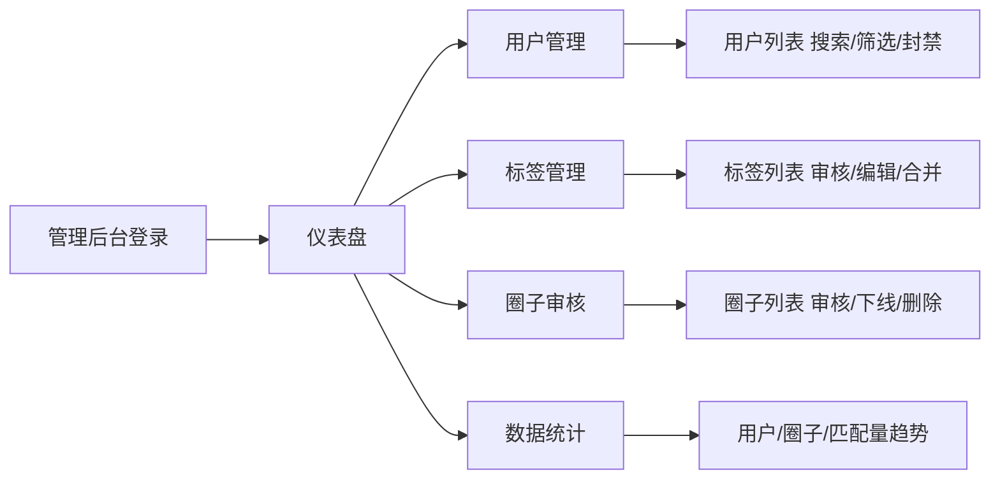

#### 功能说明

| 页面 | 核心功能 | 关键操作 |
|------|----------|----------|
| 仪表盘 | 展示平台核心数据概览 | 用户总数、圈子总数、今日匹配量、待审核数 |
| 用户管理 | 管理注册用户 | 搜索（昵称/手机号）、筛选（角色/状态）、查看详情、封禁/解封 |
| 标签管理 | 管理兴趣标签库 | 查看自定义标签、审核通过/拒绝、编辑标签分类、合并重复标签 |
| 圈子审核 | 管理已发布的圈子 | 查看圈子列表、搜索筛选、下线违规圈子、删除圈子 |
| 数据统计 | 平台运营数据可视化 | 用户增长趋势、圈子发布趋势、匹配量趋势、热门兴趣标签排行 |

---

## 5. 技术方案与架构设计

### 5.1 系统架构

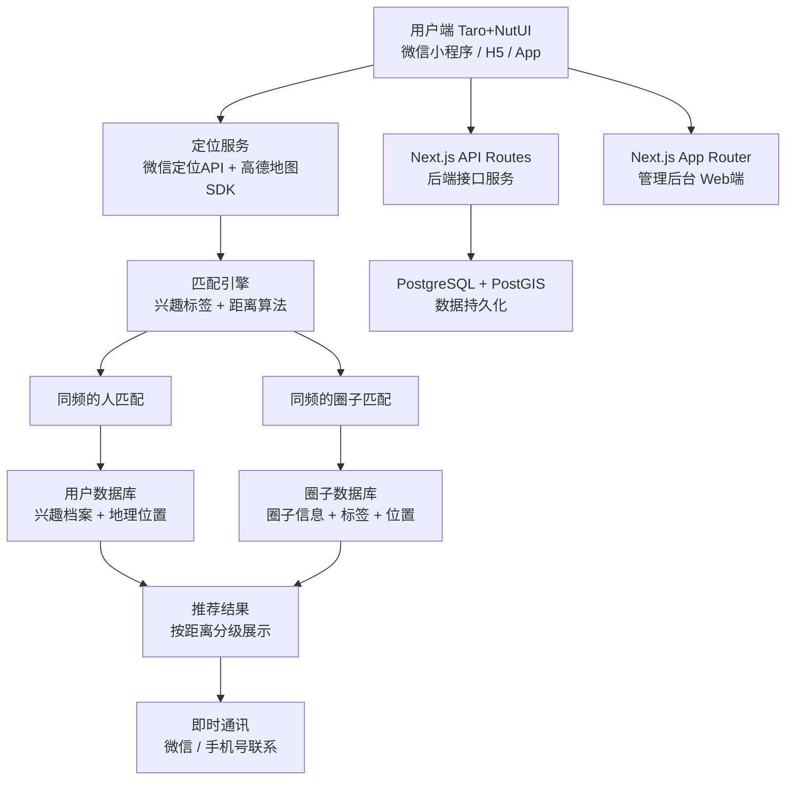

*图 7：系统整体架构*

### 5.2 关键技术选型

| 模块 | 技术方案 | 说明 |
|------|----------|------|
| 前端（用户端） | Taro + NutUI | 跨端框架，一套代码同时发布微信小程序、H5、App，基于 React 语法，NutUI 提供京东风格的移动端组件库 |
| 后端 API + 管理后台 | Next.js | 全栈 React 框架，API Routes 提供后端接口，App Router 支持管理后台页面开发，前后端统一技术栈 |
| 数据库 | PostgreSQL + PostGIS | 关系型数据库，PostGIS 地理空间扩展原生支持地理位置查询与距离计算 |
| ORM | Drizzle | 轻量级 TypeScript ORM，SQL-like 查询 API，零运行时开销，与 Next.js + PostgreSQL 无缝集成 |
| 定位服务 | 微信定位 API + 高德地图 SDK | 精准获取用户位置，支持距离计算和 POI 搜索 |
| 兴趣搜索 | Jieba/THULAC 中文分词 + 标签知识库 | 支持具体项目名称、流派、作品、技法、拼音首字母等关键词匹配 |
| 匹配算法 | 基于地理位置的同心圆筛选 + 兴趣标签权重匹配 | 按 1/5/10/30km 分级，距离 + 兴趣重合度 + 活跃度加权排序 |
| 认证 | 微信手机快捷号登录 + 短信验证码登录 | 双方式覆盖微信与非微信环境，JWT token 鉴权 |
| 通讯 | 微信模板消息 + 手机号隐私保护 | 合规前提下降低联系门槛 |

### 5.3 前端架构（Taro + NutUI）

> **选型理由**：Taro 基于 React 语法，一套代码编译为微信小程序、H5、React Native（App）；NutUI 是京东开源的移动端组件库，与 Taro 深度适配，风格统一、组件丰富；社区活跃、文档完善，适合快速迭代。

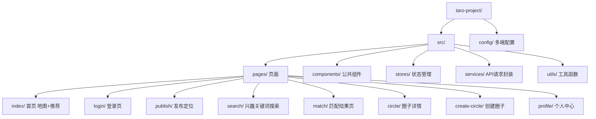

*图 8：前端 Taro + NutUI 项目结构*

### 5.4 后端架构（Next.js + PostgreSQL）

> **选型理由**：Next.js API Routes 提供轻量级后端，无需单独搭建 Node.js 服务；App Router 支持服务端渲染，管理后台开发效率高；前后端统一 TypeScript 技术栈，降低维护成本；Drizzle ORM 轻量级、零运行时开销，SQL-like API 贴近原生 SQL，开发效率高。

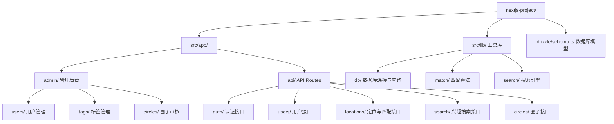

*图 9：后端 Next.js 项目结构*

### 5.5 数据库设计（PostgreSQL + PostGIS）

数据库使用 PostgreSQL 并启用 PostGIS 扩展，所有涉及地理位置的字段使用 `Point` 类型，支持空间索引和距离查询。

| 表名 | 说明 | 关键字段 |
|------|------|----------|
| users | 用户表 | id, nickname, avatar, phone, wechat_openid, location(Point), created_at |
| user_tags | 用户兴趣标签关联表 | user_id, tag_id, level(标签精度等级) |
| tags | 兴趣标签表 | id, name, category(一级), sub_category(二级), pinyin, search_count |
| circles | 圈子表 | id, title, description, location(Point), address, contact_phone, wechat, activity_time, max_members, creator_id, created_at |
| circle_tags | 圈子兴趣标签关联表 | circle_id, tag_id |
| circle_members | 圈子成员表 | circle_id, user_id, role, joined_at |
| locations | 定位发布记录 | id, user_id, location(Point), address, tags, published_at |
| contact_logs | 联系记录表 | id, circle_id, user_id, contact_type, created_at |

#### PostGIS 地理查询

- **ST_Distance** `function`：计算两点间精确距离，用于排序展示
- **ST_DWithin** `function`：查询指定半径范围内的用户/圈子，用于 1/5/10/30km 筛选
- **空间索引 (GIST)** `index`：对 location 字段创建 GIST 索引，加速地理位置查询性能
- **同心圆筛选** `query pattern`：原生支持 1km/5km/10km/30km 多级同心圆范围查询

> **匹配查询示例 SQL**：
> ```sql
> SELECT id, nickname, ST_Distance(location, ST_Point(:lng, :lat)) AS distance
> FROM users
> WHERE ST_DWithin(location, ST_Point(:lng, :lat), :range_meters)
>   AND id != :current_user
> ORDER BY distance ASC
> LIMIT 20;
> ```

---

## 6. API 接口设计

后端 API 基于 Next.js API Routes 实现，RESTful 风格，所有接口返回 JSON 格式。认证通过 Bearer Token（JWT）。

### 6.1 接口总览

| 方法 | 路径 | 功能 | 认证 |
|------|------|------|------|
| POST | /api/auth/login | 微信手机快捷号登录，换取 token | 否 |
| POST | /api/auth/sms/send | 发送短信验证码 | 否 |
| POST | /api/auth/sms/login | 手机短信验证码登录，换取 token | 否 |
| GET | /api/users/me | 获取当前用户信息 | 是 |
| PUT | /api/users/me | 更新用户资料 | 是 |
| PUT | /api/users/me/tags | 更新用户兴趣标签 | 是 |
| PUT | /api/users/me/privacy | 更新隐私设置 | 是 |
| GET | /api/tags/search | 搜索兴趣标签 | 是 |
| POST | /api/tags/custom | 创建自定义标签 | 是 |
| POST | /api/locations/publish | 发布定位 | 是 |
| GET | /api/locations/match-people | 匹配同频的人 | 是 |
| GET | /api/locations/match-circles | 匹配同频的圈子 | 是 |
| POST | /api/circles | 创建圈子 | 是 |
| GET | /api/circles/:id | 获取圈子详情 | 是 |
| PUT | /api/circles/:id | 更新圈子信息 | 是（创建者） |
| DELETE | /api/circles/:id | 删除圈子 | 是（创建者） |
| GET | /api/circles/mine | 获取我发布的圈子 | 是 |
| POST | /api/circles/:id/contact | 记录联系事件 | 是 |
| POST | /api/admin/login | 管理员登录 | 否 |
| GET | /api/admin/users | 用户列表（管理后台） | 是（管理员） |
| GET | /api/admin/tags | 标签列表（管理后台） | 是（管理员） |
| GET | /api/admin/circles | 圈子列表（管理后台） | 是（管理员） |

### 6.2 核心接口详情

#### POST /api/locations/publish — 发布定位

> **请求体**：
> ```json
> { "latitude": 39.9342, "longitude": 116.4993, "address": "北京市朝阳区朝阳公园南路1号", "tag_ids": [1, 5], "range_km": 5 }
> ```
>
> **响应**：
> ```json
> { "code": 0, "data": { "location_id": 123, "published_at": "2026-06-26T10:00:00Z" } }
> ```

#### GET /api/locations/match-people — 匹配同频的人

> **查询参数**：`latitude, longitude, tag_ids (逗号分隔), range_km, page, page_size`
>
> **响应**：
> ```json
> { "code": 0, "data": { "total": 8, "list": [{ "user_id": 1, "nickname": "李师傅", "avatar": "url", "distance_km": 0.5, "tags": [...], "activity_level": "high", "practice_years": 3 }] } }
> ```
>
> 后端使用 PostGIS `ST_DWithin` 查询 range_km 范围内用户，按距离权重(40%)+兴趣重合度(40%)+活跃度(20%) 排序。

#### GET /api/locations/match-circles — 匹配同频的圈子

> **查询参数**：`latitude, longitude, tag_ids (逗号分隔), range_km, page, page_size`
>
> **响应**：
> ```json
> { "code": 0, "data": { "total": 3, "list": [{ "circle_id": 1, "title": "朝阳公园陈氏太极拳晨练班", "distance_km": 0.8, "tags": [...], "activity_time": "每周六日 07:00", "member_count": 12, "max_members": 20 }] } }
> ```
>
> 后端查询 circles 表中 location 在 range_km 范围内、且 circle_tags 关联的 tag_id 与用户 tag_ids 有交集的圈子，按距离(30%)+兴趣重合度(50%)+活跃度(20%) 排序。

#### POST /api/circles — 创建圈子

> **请求体**：
> ```json
> { "title": "...", "tag_ids": [...], "description": "...", "latitude": 39.93, "longitude": 116.49, "address": "...", "contact_phone": "...", "wechat": "...", "activity_time": "...", "max_members": 20 }
> ```
>
> **响应**：
> ```json
> { "code": 0, "data": { "circle_id": 1, "status": "active" } }
> ```

#### GET /api/tags/search — 搜索兴趣标签

> **查询参数**：`q (关键词), limit (默认10)`
>
> **响应**：
> ```json
> { "code": 0, "data": { "list": [{ "tag_id": 1, "name": "陈氏太极拳养生八式", "category": "武术养生", "sub_category": "太极拳", "pinyin": "cstjysbs" }] } }
> ```
>
> 后端使用 Jieba/THULAC 分词后查询 tags 表，匹配 name、pinyin 字段。无匹配时返回空列表，前端展示"自定义添加"入口。

---

## 7. 状态流转设计

### 7.1 圈子状态流转

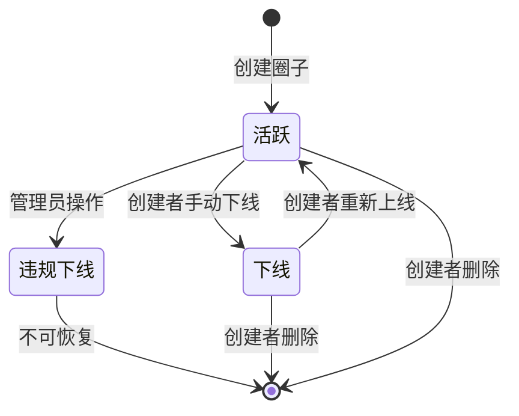

*图 2：圈子状态流转图*

### 7.2 自定义标签状态流转

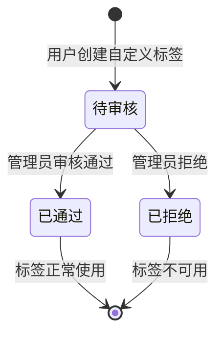

*图 3：自定义标签审核状态流转*

### 7.3 用户定位发布状态

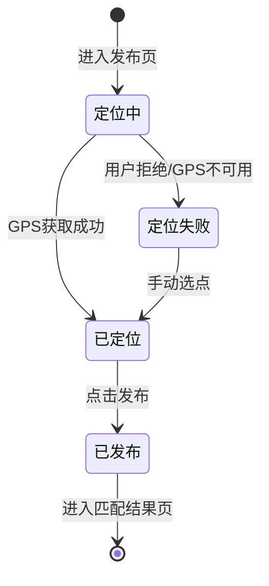

*图 4：定位发布状态流转*

---

## 8. 核心数据流

### 8.1 发布定位并匹配的数据流

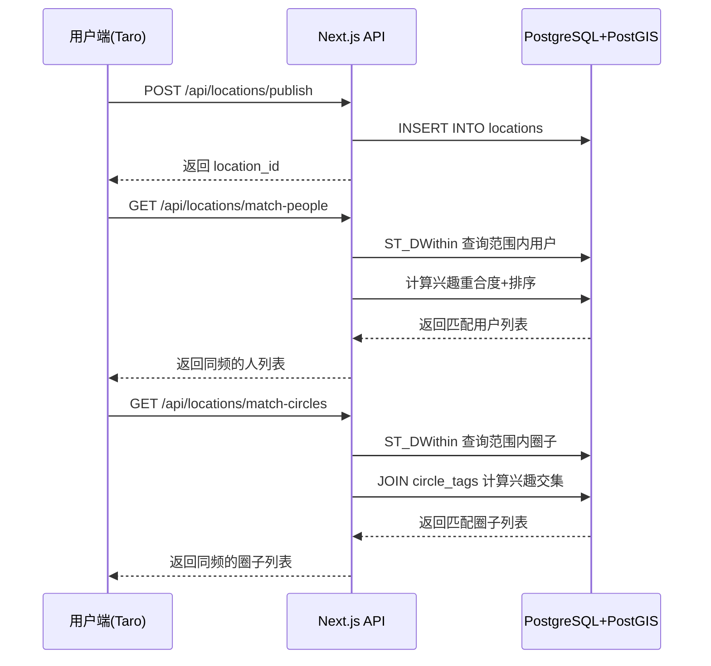

*图 5：发布定位并匹配的时序图*

### 8.2 创建圈子并被匹配的数据流

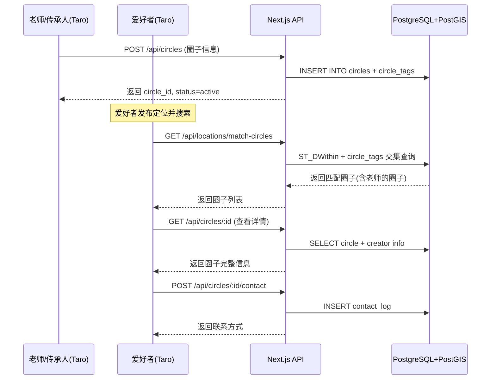

*图 6：创建圈子到被匹配联系的时序图*

---

> 同频圈功能设计文档 V1.0 · 基于 PRD 生成 · 2026-06-26
>
> 技术栈：前端 Taro + NutUI · 后端 Next.js · 数据库 PostgreSQL + PostGIS
